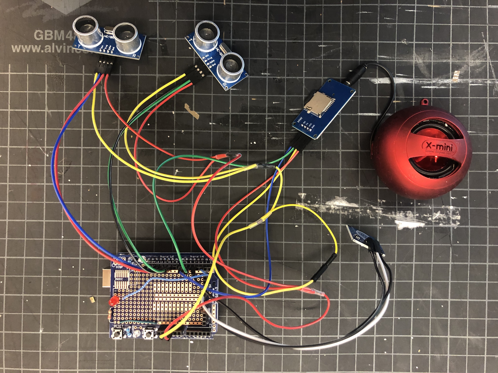
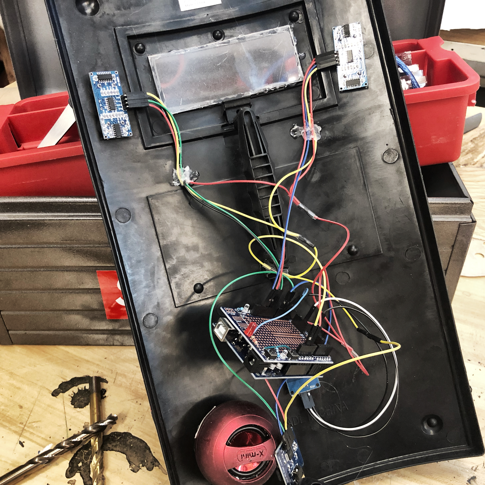
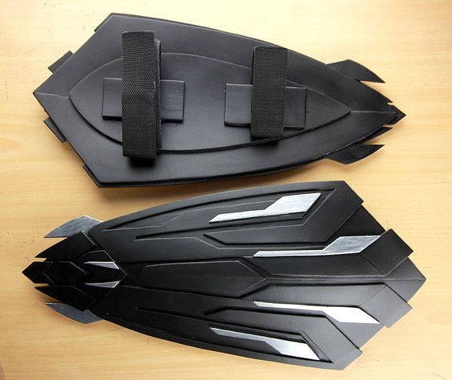

# Riojiang_CCA_DigitalElectronics_2020

# Week5-7-The most vulnerable shield 🛡🛡🛡

I use two ultrasonic sensors to detect the no-pass distance. When people approach the first sensor, it will emit a cry of pain. The second sensor says "don't leave me" when people approach it. The red light goes on when people touch the touch sensor on the shield.

I used the mp3 player to control the sound. There are two audio files corresponding to two sensors

## ⚙️Things used in this project

Arduino UNO & Genuino UNO

Arduino serial mp3 player 

Ultrasonic Sensor - HC-SR04  x2

some speaker with mp3 jack input

## Circuit
👇🏼👇🏼👇🏼

## prototype
👇🏼👇🏼👇🏼

## Final
I used spray paint to make the shield look like a war machine, so that the sound and appearance of the shield could be greatly contrasted.
👇🏼👇🏼👇🏼

# Week3-The most vulnerable shield 

When we think of shields we think of strong armies, strong men. Whenever war begins, shields help people resist attacks. But must the shield be strong inside?
So I wanted to show a shield of character, who was shy, scared, even lonely. Because no one understands the heart of a shield.

### Electrical Schematic:

### what i want to do  

🔪 when you hit this shield, it will says”you broking my heart”

📏 When you move away from shield, it will says” come here I’m so lonely”

👈 When you touch the shield, it will says” you warm my heart.”, and the shield turn to pink.

### input&output
input——Temperature sensor，Distance sensor

output——Led light，speaker

### Punch List
Must Have: 
-Temperature sensor

-Speakers

-Distance sensor

-Led light

Nice to Have:

-According to the distance the shield can make more plenty sounds

## Week 2

 What I interest project:   
   
   This project is about how to make a time machine! This DIY time control machine looks like a glove, and can "stop" any moving subject. First part of this video is about some demonstration and experiments, and second - about how to make this time machine, using Arduino, high-power LED and some tricky magic with soldering iron. You can use this for pranks and demonstration of stroboscopic effect. 

Video link: https://www.youtube.com/watch?v=rj9L1_-AzMc
