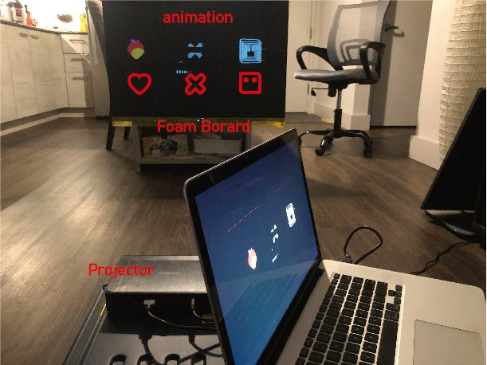

# Riojiang_CCA_DigitalElectronics_2020
#
# Fianl Project process(1) --- interactive picture wall  

In this week I finished 2 parts of work -- This week I completed two parts of the work, one is the animation which contains three graphic animations.In the other part, I tested How to use conductive pigments.

## Graphic

I have designed three shapes, which will be pasted onto the foam board and painted with conductive paint.

## Preview

In later versions, this animation was triggered when you touched the icon on the foam board made of conductive material

## Components

Now I use the computer to input the image and output the finished animation through the projector. After this version, i'll add arduino board to controll that people interactive with the picture wall.

## Electronic paint 

This was the first time I used conductive paint, so I simply made a lamp that controlled the brightness by touching the conductive paint.In this process, I found that conductive pigments need enough pigments to have good conductivity in the painting process. And unlike traditional pigments, conductive pigments are difficult to maintain a clear edge. So later, I may combine the conductive pigment with the printed pattern together which will got a perfect pattern.

#
# Fianl Project Concept --- interactive picture wall  

For the final project, I prefer to make an interactive pictures wall to tribute my favorite movie<LOVE DEATH ROBOTS>. This movie has three central concepts to express a big idea about the future world. So i want to use three different interaction ways to compose my project---Light/sounds/mechanical corresponding LOVE/DEATH/ROBOTS.

## Something special:

In this project, I'd like to use electric pigment to draw those symbols the one of the reasons is this product can do four things -- paint sensors/ Twist board into place/ fold templates / turn on. It is a good way to showing on my project, which makes it simple, clear, and easy to interact. SO I can give up a traditional touch sensor that won't  damage my picture.

## Components: 

The three parts of pictures controlled by one arduino board.

-For the first picture, when you touch the heart, that will trigger the projector to play animation on the picture.

-For the second picture, when you press the error symbol, the music will be played by the speaker behind the picture.

-For the third picture, the symbol is a robot. When you touch it, the eyes pattern will change via a roulette behind the picture.

#
#
#

# Week5-7-The most vulnerable shield 🛡🛡🛡

I use two ultrasonic sensors to detect the no-pass distance. When people approach the first sensor, it will emit a cry of pain. The second sensor says "don't leave me" when people approach it. The red light goes on when people touch the touch sensor on the shield.

I used the mp3 player to control the sound. There are two audio files corresponding to two sensors

## 🖥 Video Link: 

Because of GitHub can't show files that are big. Please view raw
https://github.com/riojiangTDD/Riojiang_CCA_DigitalElectronics_2020/blob/master/Week4-7/final%20video.zip

## ⚙️ Things used in this project

Arduino UNO & Genuino UNO

Arduino serial mp3 player 

Ultrasonic Sensor - HC-SR04  x2

some speaker with mp3 jack input

## Circuit
👇🏼👇🏼👇🏼

## prototype
👇🏼👇🏼👇🏼

## Final
I used spray paint to make the shield look like a war machine, so that the sound and appearance of the shield could be greatly contrasted.
👇🏼👇🏼👇🏼

#
#
#
#
#
#
#
#
#

# Week3-The most vulnerable shield 

When we think of shields we think of strong armies, strong men. Whenever war begins, shields help people resist attacks. But must the shield be strong inside?
So I wanted to show a shield of character, who was shy, scared, even lonely. Because no one understands the heart of a shield.

### Electrical Schematic:

### what i want to do  

🔪 when you hit this shield, it will says”you broking my heart”

📏 When you move away from shield, it will says” come here I’m so lonely”

👈 When you touch the shield, it will says” you warm my heart.”, and the shield turn to pink.

### input&output
input——Temperature sensor，Distance sensor

output——Led light，speaker

### Punch List
Must Have: 
-Temperature sensor

-Speakers

-Distance sensor

-Led light

Nice to Have:

-According to the distance the shield can make more plenty sounds

#
#
#
#
#
#
#
#
#

## Week 2

 What I interest project:   
   
   This project is about how to make a time machine! This DIY time control machine looks like a glove, and can "stop" any moving subject. First part of this video is about some demonstration and experiments, and second - about how to make this time machine, using Arduino, high-power LED and some tricky magic with soldering iron. You can use this for pranks and demonstration of stroboscopic effect. 

Video link: https://www.youtube.com/watch?v=rj9L1_-AzMc
